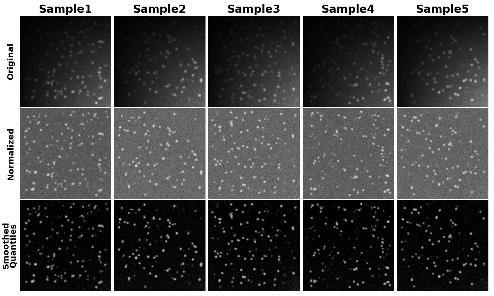

# intensipy
Normalize intensity values in 3D image stacks.

# Current Methods

## 1. [Intensify3D](https://github.com/nadavyayon/Intensify3D)

Python implementation of the Intensify3D algorithm originally developed by [Yoyan et al](https://www.nature.com/articles/s41598-018-22489-1). There are some minor adjustments:

  1. Semi-quantile normalization is the only Z-normalization method currently implemented.
  2. Pixels that are quantile normalized are optionally smoothed using they Savitzky-Galoy method outlined in the original paper. In practice this was necessary to reduce artefact noise.
  3. Tissue detection is not currently supported.

### Original Paper Results


### Intensipy Results


# Installation

Clone the repository and from the terminal run:

```pip install .```

# Example

```python
import numpy as np
import matplotlib.pyplot as plt

from intensipy import Intensify

# decreasing average intensity as z increases.
img_stack = 1 / np.arange(1, 6)[:, np.newaxis, np.newaxis]\
          * np.random.randint(0, 255, (5, 512, 512))                           

for each in img_stack: 
    plt.imshow(each, vmin=img_stack.min(), vmax=img_stack.max(), cmap='gray') 
    plt.show()

model = Intensify()
out = model.normalize(img_stack)

for each in out: 
    plt.imshow(each, vmin=out.min(), vmax=out.max(), cmap='gray') 
    plt.show()
```

# Issues:
1. Low contrast images produce low contrast image slices. Expanding contrast may be necessary for downstream analysis. Enabling tissue detection may help.

# References

1.Yayon, N. et al. Intensify3D: Normalizing signal intensity in large heterogenic image stacks. Scientific Reports 8, 4311 (2018).
